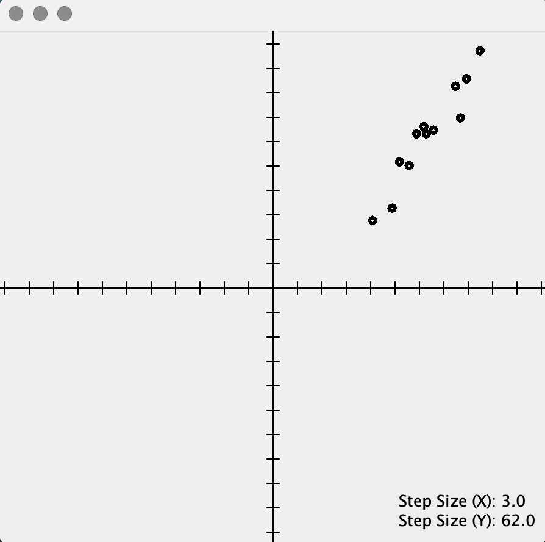

# CartesianJ 
Simple cartesian planes in Java. The motivation behind this library was the need for a tiny
lightweight tool that facilitates the visualization of mathematical functions
in Java.

Still a work in progress.

## Plotting Functions
````java
import com.duncpro.cartesianj.CartesianPlane;

import static com.duncpro.cartesianj.CartesianJ.present;
import static java.lang.Math.pow;

final CartesianPlane plane = new CartesianPlane();

plane.plot("f", x -> pow(x, 3));
plane.plot("X", x -> sqrt(x));
plane.plot("y", x -> 2 * x);

present(plane);
````

### Result


## Plotting Points
### Result

