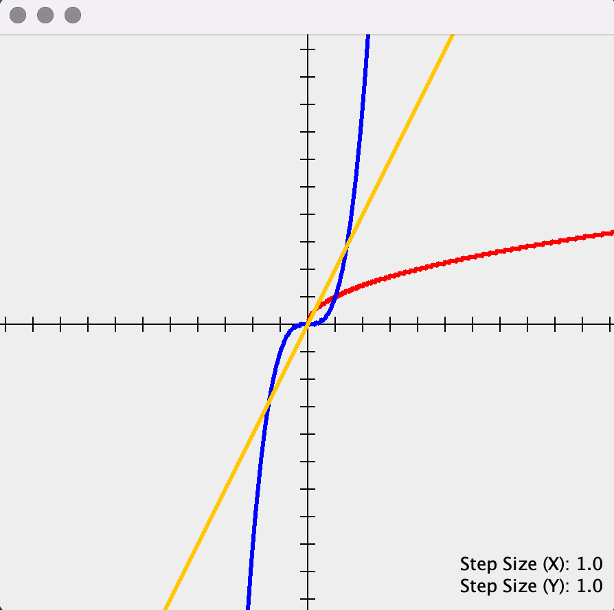
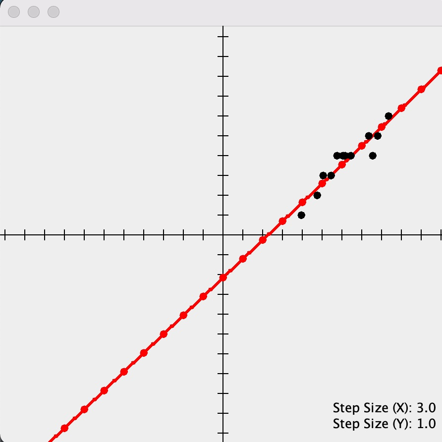

# CartesianJ 
This library provides a barebones graphing-calculator
interface which can be helpful when experimenting with new statistical and mathematical methods.

The cartesian plane can be embedded in existing Java UI's or rendered
as a standalone window using the `present` method.

## Plotting Functions
To plot a function, simply call `CartesianPlane#plot` with the name of the function
and a lambda representing the function. 
````java
import com.duncpro.cartesianj.CartesianPlane;

import static com.duncpro.cartesianj.CartesianJ.present;
import static java.lang.Math.pow;

final CartesianPlane plane = new CartesianPlane();

plane.plot("f", x -> pow(x, 3));
plane.plot("X", x -> sqrt(x));
plane.plot("y", x -> 2 * x);

// present() opens the given cartesian plane in a new window.
// Changes made to the plane after calling present() will still be reflected
// in the window. There is no need to call present twice.
present(plane);
````
* If a function with the given name is already plotted, it will be redrawn according to the new lambda.

### Result
Here is an example of the window which is drawn after running the aforementioned code.


This plot can be generated using the file `src/test/com/duncpro/cartesianj/PlotFunctionsDemo.java`.
## Plotting Points
Points can be also added to the plane using `CartesianPlane#plot(Point)`.
Here is an example of a line of best fit plotted alongside a set of points.

Run the file `src/test/com/duncpro/cartesianj/GradientDescentVisualization.java` and watch gradient descent
fit the line to the points in realtime.


## Other Features
- Qualitative and visual step size can be adjusted programmatically and
also using the menubar.
- The viewport can be fit to a data set programmatically and also using the menubar.
See `Viewport > Fit Points`
- The viewport can be offset left, right, up, and down.  
