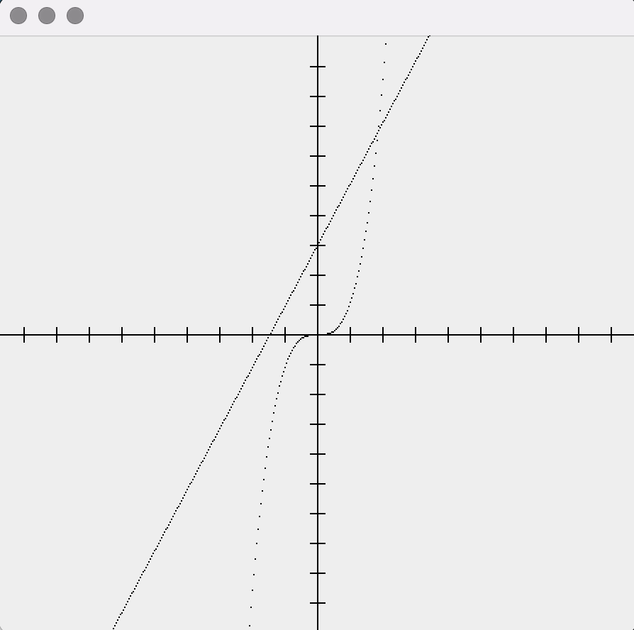

# CartesianJ 
Simple cartesian planes in Java. The motivation behind this library was the need for a tiny
lightweight tool that facilitates the visualization of mathematical functions
in Java.

Still a work in progress.

## Usage
````java
import com.duncpro.cartesian.v2.CartesianPlane;

import static com.duncpro.cartesian.v2.awt.AwtCartesianPlane.present;
import static java.lang.Math.*;

public static void main(String[] args) {
        final var plane = new CartesianPlane();
        plane.plot("f", x -> pow(x, 3));
        plane.plot("y", x -> (2 * x) + 3);
        present(plane);
    }
````

## Result

